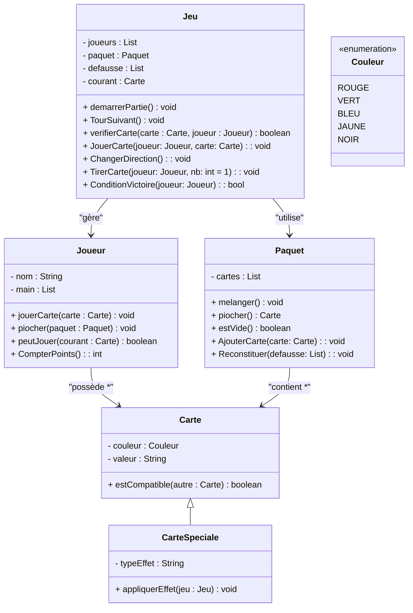

# Projet UNO – INF11107 : Programmation orientée objet I

## Informations générales
**Cours :** INF11107 – Programmation orientée objet I  
**Projet :** Implémentation du jeu de cartes UNO  
**Travail en équipe :** Groupe de 4 étudiants  
**Date de remise :** Avant **16h00**, le **9 décembre 2025**  

---

## Objectif du projet
L’objectif de ce projet est de mettre en pratique les concepts fondamentaux de la programmation orientée objet (POO) en développant une version fonctionnelle du jeu de cartes **UNO**.

La logique du jeu devra être programmée en respectant les règles essentielles, la gestion des joueurs, des cartes, des effets spéciaux, ainsi que le déroulement du tour de jeu.

---

## Référence vidéo
Pour comprendre le déroulement du jeu UNO, visionnez la vidéo suivante :  
https://www.youtube.com/watch?v=gxVgV6NkJf0&ab_channel=pratiqueTV

---

# Diagramme UML – Projet UNO



### Enums 

```markdown
enum Direction {
        Horaire
        AntiHoraire
    }

    enum TypeEffect {
        Plus2
        Inverser
        Passer
        Joker
        JokerPlus4
    }
```